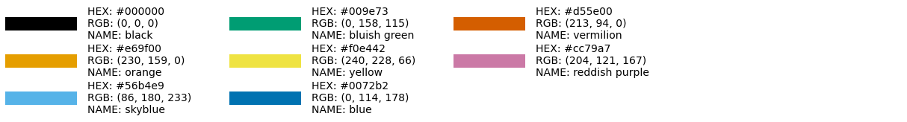
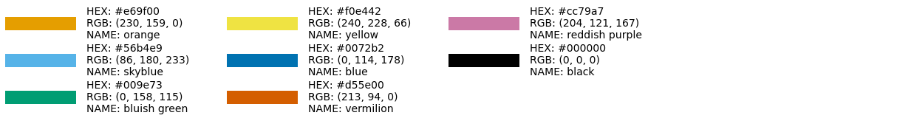
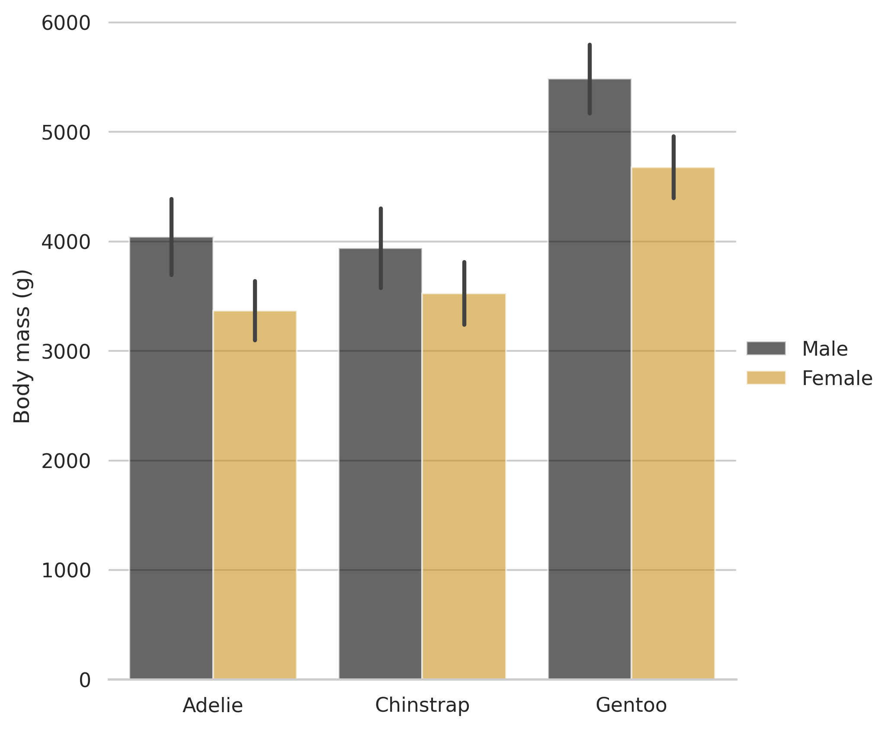

# Color Universal Design colourblind-friendly python matplotlib palette

This repository contains a python file [`cud.py`](./cud.py) which contains a dictionary, list, and associated function for creating a palette based on the [Color Universal Design][cud].

|-|Hex|Color |
|---|---|---|
| |`#f03c15` | Black |
| |`#e69f00` | Orange |
| |`#56b4e9` | Skyblue |
| |`#009e73` | Bluish Green |
| |`#f0e442` | Yellow |
| |`#0072b2` | Blue |
| |`#d55e00` | Vermilion |
| |`#cc79a7` | Redish Purple |

## Usage

Copy and paste the contents of `cud.py` into your project and use the `cud()` function as follows.

The standard 8-colour palette

```python
palette = cud()
plot_colourtable(palette)
```



Or you can offset and start from the second colour

```python
palette = cud(start=1)
plot_colourtable(palette)
```



Or only select three colours

```python
palette = cud(n=3)
plot_colourtable(palette)
```


See [`utils.py`](./utils.py) for the code used to generate the above plots.

A common usecase for such a palette would be with [`seaborn`][seaborn]

```python
import seaborn as sns
sns.set_theme(style="whitegrid")
penguins = sns.load_dataset("penguins")
palette = cud()
# Draw a nested barplot by species and sex
g = sns.catplot(
    data=penguins, kind="bar",
    x="species", y="body_mass_g", hue="sex",
    errorbar="sd", alpha=.6, height=6,
    palette=palette
)
g.despine(left=True)
g.set_axis_labels("", "Body mass (g)")
g.legend.set_title("")
```



[cud]: https://jfly.uni-koeln.de/color/
[seaborn]:https://seaborn.pydata.org
